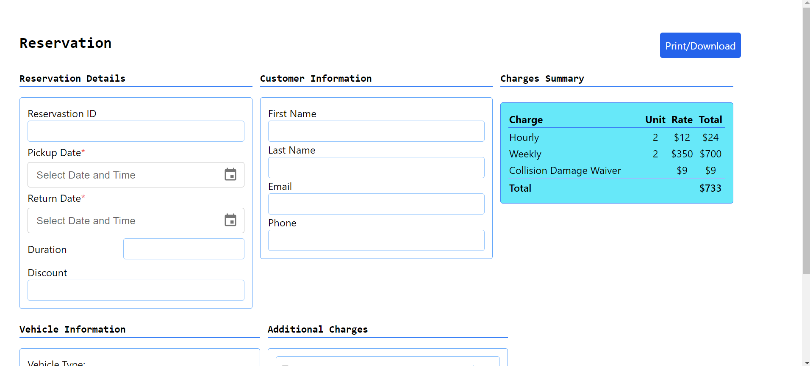

# Task

## This is Simple Task  designed to provide a straightforward and intuitive interface for managing car reservation live version can be found here [nyntax-task](https://nyntaxtask.netlify.app/)

## Screenshots

### Home

## Getting Started

To get started with the POJ Web Application, follow these steps:

1. Clone the repository: `git clone https://github.com/siddik718/nyntax.git`.
2. Navigate to API Folder: `cd back-end`.
3. Install the required dependencies: `npm install`.
4. Run the server: `npm start`.
5. Open a new terminal.
6. Navigate to Client Folder: `cd front-end`.
7. Install the required dependencies: `npm install`.
8. Run the server: `npm run dev`.

## Contributing

If you'd like to contribute to this web application, please follow these steps:

1. Fork the repository.
2. Create a new branch: `git checkout -b <branch-name>`
3. Make your changes and commit them: `git commit -m '<commit-message>'`
4. Push your changes to your fork: `git push origin <branch-name>`
5. Create a pull request.
